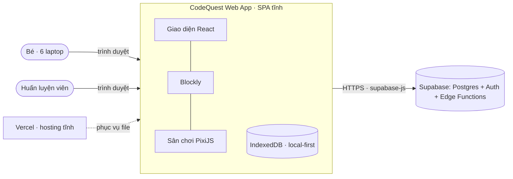
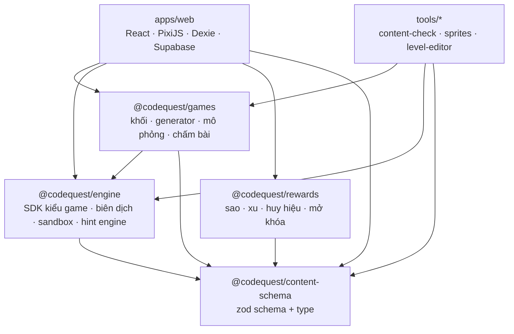
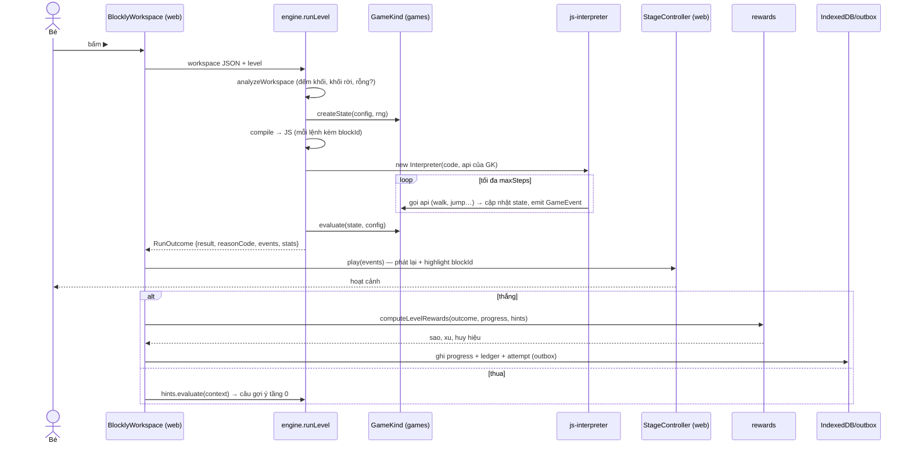

# Kiến trúc tổng thể

Nguồn chuẩn cho: các thành phần của hệ thống, ranh giới package, hướng phụ thuộc, luồng dữ liệu chính.

## 1. Bối cảnh hệ thống


- Ứng dụng là **SPA tĩnh**, không có server riêng. Supabase là backend duy nhất (từ GĐ 2).
- **Local-first:** bé chơi được khi mất mạng. Mọi thay đổi ghi vào IndexedDB trước, đồng bộ lên Supabase sau.

## 2. Các package và hướng phụ thuộc



| Package | Trách nhiệm | Được phụ thuộc | **Cấm** |
|---|---|---|---|
| `@codequest/content-schema` | Schema zod + type TS cho World, Level, Lesson, Hint, ShopItem, Badge. **Type runtime dùng chung**: `RunResult`, `ReasonCode`, `RunSummary`, `GameKindId`, `LevelMode` (file `src/runtime.ts`) | `zod` | Mọi package khác của dự án |
| `@codequest/engine` | **SDK kiểu game** (interface). Khối chung `cq_start`, `cq_repeat` và hàm đăng ký khối. Biên dịch workspace → JS. Chạy JS trong `js-interpreter`. Thu event log. Phân tích workspace. Hint engine. | `content-schema`, `zod`, `blockly`, `js-interpreter` | `games`, DOM, React, PixiJS |
| `@codequest/games` | Cài đặt từng kiểu game: khối riêng, generator, mô phỏng, chấm bài, schema `config`. Registry `gameKinds`. | `engine`, `content-schema`, `zod`, `blockly` | DOM, React, PixiJS |
| `@codequest/rewards` | Hàm thuần: tính sao, xu, huy hiệu, chuỗi ngày, mở khóa, số dư sổ xu | `content-schema` | `blockly`, DOM, I/O |
| `apps/web` | Giao diện, Blockly có hiển thị, renderer sân chơi của từng kiểu game, âm thanh, lưu trữ, đồng bộ, router | tất cả ở trên | — |
| `tools/*` | Script chạy bằng Node: kiểm chứng nội dung, làm sạch sprite, level editor | `engine`, `games`, `content-schema` | `apps/web` |

**Vì sao chia như vậy:**
- Mô phỏng và chấm bài **headless** nên `tools/content-check` chạy lời giải của mọi màn trên Node (CI) và cho đúng kết quả như trong trình duyệt.
- `engine` không biết có những kiểu game nào. Nó chỉ biết interface. Thêm kiểu game mới không phải sửa `engine`.
- `rewards` tách riêng và thuần, nên test được kỹ và đồng bộ được (server có thể tính lại).

**Cách thực thi ranh giới:**
- ESLint `no-restricted-imports` theo từng package (bảng trên) + `no-restricted-globals` (`window`, `document`, `localStorage`, `navigator`) trong 4 package headless.
- Unit test của 4 package headless chạy với `environment: 'node'`.
- Package nội bộ là **source-only**: `package.json` trỏ `exports` thẳng vào `src/index.ts`, không có bước build riêng. Vite và Vitest đọc TS trực tiếp. Xem ADR-0001.

## 3. Cấu trúc `apps/web/src`

```
app/        Khởi động, router, provider, error boundary, layout chung
screens/    Một thư mục cho mỗi route (profile, map, world, lesson, play, shop, badges, group, coach, settings)
features/   Logic theo nghiệp vụ dùng chung giữa màn hình: progress, coins, hints, profiles, sync
blockly/    Wrapper React cho Blockly, theme CodeQuest, renderer config, toolbox builder, popover chỉ bước tiếp
stages/     Renderer sân chơi cho từng kiểu game (runner/, maze/, robotlab/…) + StageController chung
ui/         Design system: Button, Panel, Bubble, Hud, StarBurst, CoinFly, Modal…
audio/      Quản lý âm thanh (Howler), giọng đọc
data/       Dexie DB, repository, outbox, Supabase client
i18n/       vi.ts: chuỗi giao diện (không phải nội dung bài học)
lib/        Tiện ích nhỏ không thuộc nghiệp vụ
```
Quy tắc: `screens/*` được import `features/*`, `ui/*`, `blockly/*`, `stages/*`. `ui/*` không import gì của nghiệp vụ. `features/*` không import `screens/*`.

## 4. Luồng chính: bé bấm ▶ Chạy



Điểm mấu chốt: **chạy xong toàn bộ trước, rồi mới phát lại** (run-then-replay, học từ Blockly Games). Nhờ vậy:
- Biết kết quả trước khi diễn: thua thì phát chậm hơn, thắng thì phát nhanh.
- Vòng lặp vô hạn bị cắt bởi `maxSteps`, giao diện không bao giờ treo.
- Phát lại tua, dừng, chạy từng bước được, vì event log là dữ liệu.

## 5. Mối quan tâm xuyên suốt
| Chủ đề | Tài liệu |
|---|---|
| Sandbox, event log, giới hạn, tất định | `runtime-engine.md` |
| Viết một kiểu game | `game-kind-sdk.md` |
| Blockly: theme, toolbox, khối, generator, gợi ý chỉ bước tiếp, phím tắt | `blockly-integration.md` |
| Dữ liệu nội dung và kiểm chứng | `content-model.md` |
| Gợi ý | `hint-engine.md` |
| Phần thưởng | `rewards-engine.md` |
| PixiJS, sprite, asset | `stage-rendering.md` |
| Lưu trữ, đồng bộ, đăng nhập | `data-sync-auth.md` |
| Kiểm thử | `testing-strategy.md` |
| Quyền riêng tư | `security-privacy.md` |
| Dev, CI, deploy | `deployment-ops.md` |
