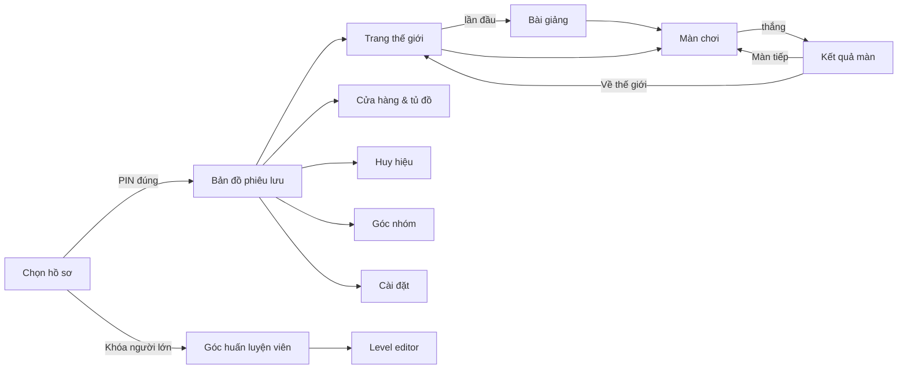

# Màn hình & luồng

Nguồn chuẩn cho: danh sách màn hình, đường đi giữa các màn hình, trạng thái của từng màn hình. Phong cách xem `art-direction.md`; câu chữ xem `ui-copy-guide.md`.

Kích thước thiết kế: **1366×768**, tối thiểu **1280×720**. Nhỏ hơn 1280×720 thì hiện màn hình "Màn hình nhỏ quá, con mở trên laptop nhé".

## 1. Sơ đồ luồng



## 2. Danh sách màn hình

| Route | Màn hình | Thành phần chính | Trạng thái cần thiết kế |
|---|---|---|---|
| `/` | **Chọn hồ sơ** | Lưới avatar (không cần đọc chữ), bàn phím PIN 4 số to, nút "+" tạo hồ sơ | chưa có hồ sơ nào (chuyển thẳng sang tạo hồ sơ) · đang tải · sai PIN (rung nhẹ, không khóa) |
| `/profile/new` | **Tạo hồ sơ** (GĐ 1) | Bước 1 chọn avatar (12 avatar) → bước 2 nhập biệt danh (≤ 12 ký tự, có thể để người lớn gõ) → bước 3 đặt PIN 4 số, nhập lại lần 2 | PIN 2 lần không khớp · biệt danh trùng trên máy. Từ GĐ 2: hồ sơ do huấn luyện viên tạo, máy chỉ "Ghép máy" bằng mã 6 số |
| `/map` | **Bản đồ phiêu lưu** | Bản đồ pixel cuộn ngang, 10 đảo, Măng đứng ở thế giới hiện tại, HUD xu/sao/chuỗi ngày | thế giới khóa / mở / hoàn thành · mở thế giới mới (hiệu ứng mở đường) |
| `/w/:worldId` | **Trang thế giới** | Đường các màn kiểu bậc đá, sao của từng màn, boss, nút bài giảng, màn sáng tạo | màn khóa / mở / ⭐ 1–3 · `challenge` tùy chọn có nhãn riêng |
| `/w/:worldId/lesson/:lessonId` | **Bài giảng** | Thẻ lớn, Măng nói, ví dụ chạy được (workspace chỉ đọc + sân chơi nhỏ), nút 🔊 | thẻ trước/sau · thẻ có câu hỏi nhanh |
| `/play/:levelId` | **Màn chơi** | Thanh trên, sân chơi, mục tiêu, điều khiển, thanh khối, vùng ghép khối, bong bóng Măng (bố cục ở §3) | đang ghép · đang chạy · đang phát lại từng bước · thua (bong bóng + rung khối) · thắng (chuyển sang Kết quả) |
| (lớp phủ) | **Mục tiêu ⭐** (P2-21) | Màn có `starGoals`: mỗi dòng một mức sao (⭐ Tới nơi · ⭐⭐ + Nhặt hết măng · ⭐⭐⭐ + Không quá N khối), dòng nhiệm vụ, nhắc gợi ý lớn làm bớt sao, nút "Chơi thôi!" | hiện khi vào màn · mở lại bằng nút sao |
| (lớp phủ) | **Kết quả màn** | Măng ăn mừng, sao bay, xu bay vào ví, "con vừa viết N dòng code", nút Màn tiếp / Chơi lại / Về thế giới; màn có `starGoals`: từng mục tiêu ✔/✖ | 1/2/3 sao · có huy hiệu mới · mở thế giới mới · thiếu mục tiêu / quá số khối / do gợi ý |
| (lớp phủ) | **Hộp gợi ý** | 3 tầng, giá, số dư, câu "Cần thêm N xu" | đủ / thiếu xu · tầng 1 miễn phí sau 3 lần thua |
| `/shop` | **Cửa hàng & tủ đồ** | Lưới vật phẩm pixel, xem trước trên Măng, mua / mặc | chưa mua / đã mua / đang dùng / thiếu xu |
| `/badges` | **Huy hiệu** | Album huy hiệu và sticker | có / chưa có (bóng mờ + gợi ý cách đạt) |
| `/group` | **Góc nhóm** | Mục tiêu chung, thanh tiến độ, tường tác phẩm sáng tạo | chưa có mục tiêu · đang chạy · đã đạt |
| `/settings` | **Cài đặt** | Âm lượng nhạc / hiệu ứng / giọng đọc, giảm chuyển động, theme mù màu, đổi avatar, **Sao lưu tiến độ** (tải file JSON) / **Khôi phục**, **Xóa hồ sơ trên máy này** (cần PIN + xác nhận 2 bước) | khôi phục thành công / file lỗi |
| `/coach` | **Góc huấn luyện viên** | Bảng 6 bé × thế giới, khái niệm yếu, màn hay kẹt, thời gian học, mở khóa thủ công, đặt mục tiêu nhóm | chưa đăng nhập · đang đồng bộ · bé lâu không học |
| `/coach/editor` | **Level editor** | Vẽ bản đồ, chọn toolbox, ghép lời giải, xem trước, kiểm chứng, xuất JSON; nhiệm vụ, hình đích, mục tiêu sao; vét cạn in "par (mục tiêu) N · thắng thường M" | hợp lệ / có lỗi kiểm chứng |

Khóa người lớn để vào `/coach`: giải một phép nhân hai chữ số (vd 17 × 6), sau đó đăng nhập Supabase. Từ P2-07 khóa phép nhân đã có (`screens/coach/AdultGate.tsx`, giải một lần cho mỗi tab). Phép nhân thì bé 8–11 tuổi cũng giải được, mà editor lại hiện lời giải, nên **`/coach/editor` chỉ có trong bản dev** (`npm run dev`, HLV soạn nội dung trên máy mình) cho tới khi P2-16 thêm đăng nhập HLV; bản build cho bé không có route này.

## 3. Bố cục màn chơi (1366×768)

```
┌──────────────────────────────────────────────────────────────────────────┐ 56px
│ ← Bản đồ    Làng Tre · Màn 5        ⭐⭐☆           🪙 120    🔊  ⚙       │
├──────────────────────────────┬─────────┬─────────────────────────────────┤
│                              │ THANH   │                                 │
│   SÂN CHƠI (PixiJS)          │ KHỐI    │   VÙNG GHÉP KHỐI (Blockly)      │
│   tỷ lệ 16:10                │ 150px   │                                 │
│                              │         │                                 │
├──────────────────────────────┤         │                                 │
│ 🎯 Mục tiêu (1 dòng)         │         │                                 │
│ [▶ CHẠY ␣]  ⏭ S  🐢━●━🐇  ↺ R│         │   🧱🧱🧱 còn N khối    💡 Gợi ý H│
├──────────────────────────────┴─────────┴─────────────────────────────────┤ 72px
│ 🐼 Măng: bong bóng thoại (≤ 12 chữ)  🔊                                  │
└──────────────────────────────────────────────────────────────────────────┘
```
- Cột trái khoảng **42%**, phần Blockly (thanh khối + vùng ghép) khoảng **58%**. Có thanh kéo để đổi tỷ lệ (30–55%), nhớ theo từng bé.
- Runner có đường dài hơn sân chơi: ngay dưới sân chơi (trên dòng Mục tiêu) là **dải cả đường** cao ~35–48 px (có nút "Xem cả đường" ở đầu phải): mọi ô, Măng ở ô nào (khung vàng, chạy theo lượt phát), khung trắng là phần sân chơi đang thấy. Chiều cao lấy từ sân chơi, không lấy từ vùng ghép; ở 1280×600 màn chơi vẫn không cuộn. Đường vừa sân thì không có dải. Chi tiết: `architecture/stage-rendering.md` §2.
- **Xem cả đường** (P2-22): nút kính lúp ở đầu phải dải (không có dải, hoặc maze: góc trên phải sân chơi) mở khung lớn "Cả đường" / "Cả mê cung": hình to của bản đồ đang chọn, kéo chuột / lăn chuột / phím mũi tên để xem, thước số ô ở mép dưới (maze thêm mép trái), ô xuất phát và đích, Măng đang đứng ở đâu, bấm ô (hoặc Enter: ô ở giữa) để đánh dấu (không lưu). Khung tự đóng khi lượt chạy kết thúc. Đóng bằng ✕, `Esc` hoặc bấm ra ngoài. Khi Măng không chạy, kéo trên dải thì sân chơi cuộn theo; Làm lại / Chạy trả camera về Măng. Chi tiết: `architecture/stage-rendering.md` §2, §4.
- **Dòng nhiệm vụ và mục tiêu** (P2-11c): màn có `mission` hiện dòng nhỏ "NHIỆM VỤ" (câu chuyện: Măng làm gì cho ai) **trên** dòng "MỤC TIÊU" (`objective`: việc bé phải làm), mỗi dòng một nút 🔊 (`<id>.mission`, `<id>.objective`, chỉ hiện khi có file giọng). Quyết định: cả hai cùng hiện, vì `mission` là động lực, `objective` mới là nhiệm vụ lập trình; Măng vẫn chỉ nói câu sẵn sàng khi vào màn. Ô đích vẽ theo `goalSprite` (máy, cửa ra, nhà…; `architecture/stage-rendering.md` §4 "Hình đích").
- **Mục tiêu ⭐** (P2-21, `rewards-economy.md` §1): màn `build`/`bughunt` có `starGoals` mở thẻ "Mục tiêu sao" ngay khi vào màn (trước gợi ý tầng 0 `enter`, gợi ý chờ thẻ đóng): ⭐ Tới nơi · ⭐⭐ + từng mục tiêu (`collectAll`: "Nhặt hết măng") · ⭐⭐⭐ + "Không quá `par` khối" (bughunt: "Sửa không quá `parEdits` khối"), kèm "Xem bước tiếp hay lời giải thì bớt sao." Đóng bằng "Chơi thôi!", `Esc` hoặc bấm ra ngoài; nút ba ngôi sao cuối dòng mục tiêu mở lại; đóng thẻ thì focus về sân chơi (Space là Chạy, không mở lại thẻ). Lượt thắng thiếu mục tiêu: Măng nói "Tới nơi rồi! Nhưng còn măng chưa nhặt." (không khen số khối). Kết quả màn: hàng chip ✔/✖ (Tới nơi, từng mục tiêu, số khối, và ✖ "Không xem bước tiếp hay lời giải" khi gợi ý làm bớt sao; thiếu mục tiêu ⭐⭐ thì chip số khối mờ, không ✔/✖, vì số khối không thêm sao được); màn nhiều bản đồ ghi "Chưa đạt ở bản đồ N" (mục tiêu phải đạt trên **mọi** bản đồ, ADR-0017). Câu của Măng: ⭐⭐ "Đạt mục tiêu rồi! Thử ít khối hơn nhé?", ⭐ "Qua màn rồi! Nhặt hết măng là thêm sao."; bớt sao vì gợi ý thì giữ câu cũ. Màn không có `starGoals` không đổi gì. Mã: `screens/play/StarGoalsCard.tsx`, `features/play/starGoals.ts` (thuần, có test: dòng thẻ, chip, câu Măng `goalLineKey`); e2e `play-goals.spec.ts` (màn `_sandbox` `runner-goals`, `maze-predict` có `goalSprite: exit`).
- **Khối điều kiện** (P2-11, Thế giới 4–5): thanh khối có nhóm "ĐIỀU KIỆN" (`nếu`, `nếu … nếu không`), "LẶP" (cả `lặp đến khi`) và "CÂU HỎI" (khối hỏi; với bé gọi là câu hỏi, không nói cảm biến). Ô câu hỏi trống là một lỗ lục giác nền sáng viền nét đứt để cắm khối hỏi; chạy với ô trống thì Măng nói câu `EMPTY_CONDITION` và khối có ô trống rung. Mỗi lần khối hỏi được hỏi khi phát lại, nó sáng **xanh ✔** hoặc **đỏ ✘** (viền + huy hiệu tròn ở góc phải trên) và khối hỏi nó (nếu / lặp đến khi) sáng vàng, theo đúng tốc độ; chế độ Từng bước dừng **trước mỗi câu hỏi** (cả khi vòng `lặp đến khi` hỏi lại), dấu ✔/✘ giữ nguyên trong lúc chờ. Vòng lặp không dừng (`TIMEOUT`): phát khoảng 3 giây đầu (câu G13) rồi Măng xoay vòng, sao quay trên đầu ("chóng mặt") và đứng choáng tới khi Làm lại; Măng nói câu `TIMEOUT`. Màn có `maxLoopDepth` / `maxInstances`: thả một khối làm vượt giới hạn (lặp trong lặp, quá số khối cho phép) thì thao tác bị hoàn tác (khối về thanh khối hoặc chỗ cũ) và Măng nói "Màn này đừng đặt khối lặp trong khối lặp nhé!" / "Khối này đủ rồi. Dùng lại khối đã có nhé!". Gợi ý tầng 0 có `point: "step"` làm nút Từng bước nhấp nháy như nút Chạy. e2e `play-conditions.spec.ts`.
- Chương trình rộng hơn vùng ghép (vd `nếu … nếu không` trong vòng lặp) được thu nhỏ vừa đủ để thấy hết bề ngang (không dưới 0,7), lúc vào màn và sau khi sửa (`blockly-integration.md` §5).
- **Vật phẩm nhiệm vụ** (P2-11c, ADR-0019): chìa khóa (vàng) và bạn (Gà con) đứng ở ô của chúng trên sân chơi, dải cả đường, "Xem cả đường" và hình thẻ đáp án. Góc trên trái sân chơi có bảng nhỏ một biểu tượng cho mỗi vật phẩm, mờ tới khi nhặt (mê cung: sau dãy măng). Đích (cờ, dấu chân, nhà…) **mờ tím** tới khi nhặt đủ; lồng (`cage`) đổi sang lồng mở. Nhặt bạn thì bạn đi theo sau Măng. Tới đích mà thiếu (`NEED_KEY` / `NEED_FRIEND`): vật phẩm còn lại nhấp nháy có khung, đích nhấp nháy, Măng nói "Cần chìa khóa trước!" / "Chưa đón bạn kìa!" (hoặc gợi ý tầng 0 của màn).
- Mode `predict`: vùng ghép khối **chỉ đọc**, không có nút Chạy/Từng bước/tốc độ/Làm lại (và không có phím tắt Space/S/R). 3–4 thẻ đáp án có hình nằm **thành một hàng dưới vùng ghép** (cột phải), không ở chỗ điều khiển bên trái: thử ở cột trái thì sân chơi còn ~250px và hình thẻ quá nhỏ; ở cột phải sân chơi giữ to để xem phát lại, chương trình ngắn vẫn đọc hết. Bấm một thẻ: chấm ngay (đúng → "Đúng rồi! Cùng xem Măng đi nhé!", thẻ xanh ✓; sai → câu `WRONG_ANSWER`, thẻ đỏ ✗ và khóa), rồi **phát lại chương trình** để bé thấy chuyện thật. Sai: hết phát lại thì "Thấy chưa? Giờ con chọn lại nhé!". Đúng: hết phát lại thì hiện lớp phủ kết quả. Sao theo số lần chọn, đếm qua mọi phiên (`rewards-engine.md` §3).
- Mode `parsons`: thanh khối ẩn; khối nằm rải rác trong vùng ghép. Khối rời **giữ nguyên màu** (không bị `disableOrphans` phủ sọc xám) và có **viền nét đứt** + mờ nhẹ, nối vào "khi bắt đầu" thì viền liền lại (trả lời câu hỏi của HLV từ P0-05). Không xóa/nhân bản được khối nào (không có thùng rác), nên bài luôn giải được.
- Mode `bughunt`: thanh dưới vùng ghép có nhãn "Săn lỗi: sửa ít nhất có thể", bộ đếm "Đã sửa N khối" (cập nhật ngay khi sửa, `editDistance` so với chương trình ban đầu; nền đỏ nhạt khi vượt `parEdits`) và "Chuẩn: `parEdits`". Thắng: "Chỉ sửa N khối, giỏi quá!" hoặc "Hết lỗi rồi! Thử sửa ít khối hơn nhé?".
- Mode `creative`: thanh dưới vùng ghép có nhãn "Sáng tạo: không có đúng sai" và nút **Lưu**. Chạy không chấm, không có lớp phủ kết quả (hết phát lại: "Măng diễn xong rồi! Bấm Lưu để giữ nhé."). Lưu ghi bảng `creations` (mỗi bé một bản cho mỗi màn, lưu lại thì thay) và lần đầu được +10 xu ("Đã lưu! Con được 10 xu."). Nút "Khoe với nhóm" có từ GĐ 2.

## 4. Phím tắt
Phím tắt của app không hoạt động khi bé đang điều hướng Blockly bằng bàn phím (Blockly 13 dùng `Space`/`Enter`/`H`/`Esc` cho việc đó). Kéo thả bằng chuột xong thì `Space` chạy được ngay. Chi tiết: `architecture/blockly-integration.md` §13.
| Phím | Tác dụng | Ở đâu |
|---|---|---|
| `Space` | Chạy / Dừng | Màn chơi, khi con trỏ không ở trong ô nhập |
| `S` | Chạy từng bước | Màn chơi |
| `R` | Làm lại (đưa sân chơi về đầu, giữ chương trình) | Màn chơi |
| `H` | Mở hộp gợi ý | Màn chơi |
| `Esc` | Đóng lớp phủ | Mọi nơi |
| `←` `→` | Thẻ trước / sau | Bài giảng |

## 5. Trạng thái trống & lỗi
| Tình huống | Hiển thị |
|---|---|
| Mất mạng | Chơi bình thường (local-first); biểu tượng mây gạch chéo nhỏ ở góc. Không hiện popup |
| Đồng bộ lỗi | Chỉ hiện trong Góc huấn luyện viên |
| Nội dung màn bị lỗi | "Màn này đang được sửa" + nút về thế giới; ghi lỗi vào console |
| Chương trình rỗng mà bấm chạy | Măng: "Con chưa ghép khối nào. Kéo khối vào đây nhé" + chỉ vào thanh khối |

## 6. Ghi chú cài đặt (P1-10)
- **Mã nguồn:** `apps/web/src/screens/{profile,map,world,lesson,play,settings}/`, khung dùng chung ở `screens/shared/` (`TopBar`, `ScreenMessage`). Định tuyến ở `app/App.tsx`; mọi route sau `/` đi qua `RequireProfile` (chưa chọn hồ sơ → về `/`).
- **Hồ sơ đang chơi:** `features/profiles/CurrentProfile.tsx` (React context). Chỉ lưu `profileId` trong `sessionStorage` của tab: tải lại trang không hỏi lại PIN, đóng tab thì hỏi. "Đổi người chơi" và mọi lần vào `/` đều đăng xuất (bấm Back không quay lại bản đồ của bé trước). PIN bắt buộc 4 số, nhập 2 lần khi tạo; sai PIN thì rung và xóa, không khóa.
- **12 avatar** là mặt con vật pixel 16×16 vẽ bằng token màu (`ui/Avatar.tsx`), không cần file ảnh.
- **Phiên màn:** `features/play/usePlaySession.ts` theo đúng "Quy ước gọi" của `rewards-engine.md` §3: lượt chạy được ghi ngay khi engine chạy xong (dù phát lại bị dừng), thắng thì `saveLevelResult` ngay; phiên đang mở được chép vào `sessionStorage` sau mỗi lượt và đóng (`recordSession` + `saveAttempt`) khi rời màn, hoặc ở lần vào màn sau nếu tab bị đóng giữa chừng. Phiên không có lượt chạy nào thì không ghi `attempts`. Bản nháp workspace tự lưu sau 1 s, kèm mã băm của màn: màn đổi nội dung thì bản nháp cũ bị bỏ.
- **Mở bằng đường link:** `/play/:levelId` và bài giảng kiểm `isUnlocked` (màn đã qua coi như mở; cờ dev `?unlock=all` được tính). Màn chưa mở hoặc kiểu chơi chưa làm (`features/content/modes.ts`) hiện câu thân thiện + nút về thế giới.
- **Trang thế giới:** bài giảng + các màn là một đường bậc đá uốn khúc 6 viên mỗi hàng (trái → phải, rồi phải → trái), 16 màn + bài giảng vừa 3 hàng trong khung 1280×600 không cần cuộn; thế giới dài hơn thì cuộn trong khung và tự đưa màn sắp chơi vào tầm nhìn. Thứ tự Tab theo thứ tự màn. Bài "Khối mới" (`lesson.beforeLevel`) là một quyển sách nhỏ gắn ở góc trên bên trái viên đá của màn đó (không thêm viên đá, nên Thế giới 1 vẫn vừa 3 hàng); Tab tới sách trước rồi mới tới màn. Khi màn đó là màn tiếp mà bé chưa xem bài, Măng nói "Có khối mới! Xem bài khối mới trước nhé." và quyển sách nhấp nháy thay cho viên đá màn (màn vẫn mở). Xem xong bấm "Vào chơi" là vào đúng màn đó. Màn sáng tạo luôn mở nhưng chỉ là "màn tiếp" khi các màn khác đã qua; đang chờ bài giảng thì không màn nào là "màn tiếp".
- **Cài đặt:** phần "Dành cho người lớn" (sao lưu, khôi phục, xóa) mở bằng PIN của hồ sơ.
- **Lớp phủ kết quả:** sao bay lần lượt, xu bay vào ví trên thanh trên (`[data-hud-coins]`), liệt kê từng dòng xu nhận được; `Esc` = Chơi lại. "Màn tiếp" chỉ hiện khi màn sau trong `world.levelIds` đã mở.
- **`/restore`** (thêm so với §2): khôi phục file sao lưu khi máy chưa có hồ sơ nào (máy mới), để huấn luyện viên không phải tạo hồ sơ tạm. Trong Cài đặt cũng có Khôi phục. Sao lưu xuất **mọi** hồ sơ trên máy.
- **Màn hình nhỏ quá:** lớp phủ (app vẫn chạy bên dưới, không mất màn đang chơi); xét kích thước **màn hình** (`screen`) < 1280×720, hoặc cửa sổ < 1000×520 (laptop 1280×720 thật chỉ còn ~1280×600 cho trang vì thanh trình duyệt).
- **Nhắc nghỉ:** đếm thời gian tab đang hiện, sau 25 phút hiện lớp phủ "Mình chơi lâu rồi. Đứng dậy vươn vai nhé!" với nút "Mình nghỉ xong rồi"; máy ngủ (khoảng trống > 60 s) không tính; thời gian đã chơi giữ qua lần tải lại trang (`sessionStorage`). Màn chơi vừa khung 1280×600 (laptop 1280×720 trừ thanh trình duyệt) không cần cuộn.
- **Chế độ tác giả (chỉ bản dev):** `?author=1` hiện nút "Sao chép workspace JSON" trên thanh trên màn chơi; `?unlock=all` mở mọi thế giới và màn. Cờ được nhớ trong tab; `?author=0` / `?unlock=0` để tắt.
- **Thế giới "Sân thử" (chỉ bản dev):** các file trong `content/worlds/_sandbox/` (không có `world.json`) được gom thành một thế giới tổng hợp ở cuối bản đồ (`features/content/sandbox.ts`), luôn mở. Bài giảng mẫu `lesson-sample` và hai màn `flow-01`, `flow-02` là mẫu dev; từ khi Thế giới 1 có bài giảng và đủ màn, `e2e/flow.spec.ts` chạy trên Thế giới 1 thật.
